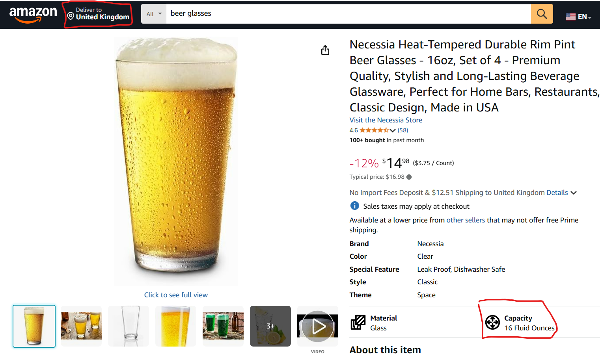
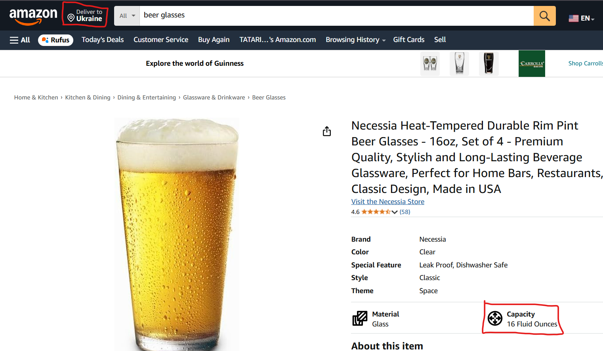

# Volume measurement unit doesn't change based on region
## BUG-LOC-3
### Localization Bug Type
### Description
What the region is changed to the UK from Ukraine and otherwize, the volume measurement remains the same, but it has to be changed from fluid ounces to pints or liters
### Steps to Reproduce
1. Enter Amazon main page
2. Search for any 'beer glass'
3. Check the volume measurement
4. Change the region from UK to Ukraine(or other country where volume unit is liter)
5. Check the volume measurement again
### Expected Result
The Volume Measurement unit is changed from ounces to liters when the country region is chaged from UK to Ukraine
### Actual Result
The Volume Measurement unit remains the same (fluid ounces)
### Priority
P3 - Low 
### Severity
S4 - Cosmetic
### Environment
1. Browser Version: Google Chrome Version 135.0.7049.115
2. Web Application Version: Amazon 2025 (no version info found)
### Logs

