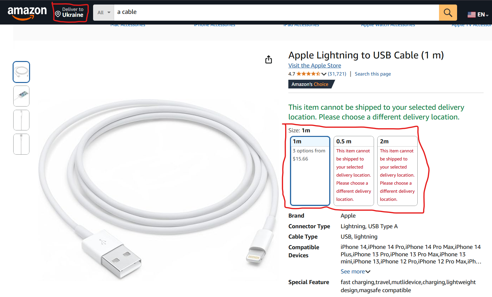
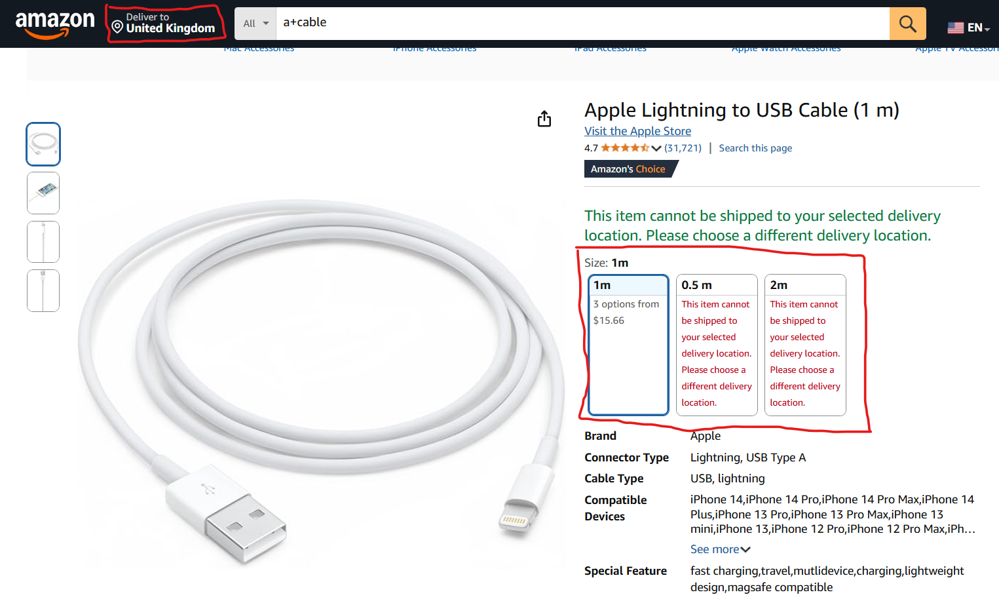

# Wrong length formating based on user's country region
## BUG-LOC-4
### Localization Bug Type
### Description
When the country region is changed from UK to Ukraine the legth unit have to be changed from incges to meters and back the same
### Steps to Reproduce
1. Enter Amazon main page
2. Search for any 'a cable'
3. Check the length measurement
4. Change the region from UK to Ukraine (or other country where length unit is meter)
5. Check the volume measurement again
### Expected Result
The length will be changed from inches to meters
### Actual Result
The length do not change anyhow
### Priority
P3 - Low
### Severity
s4 - Cosmetic
### Environment
1. Browser Version: Google Chrome Version 135.0.7049.115
2. Web Application Version: Amazon 2025 (no version info found)
### Logs

