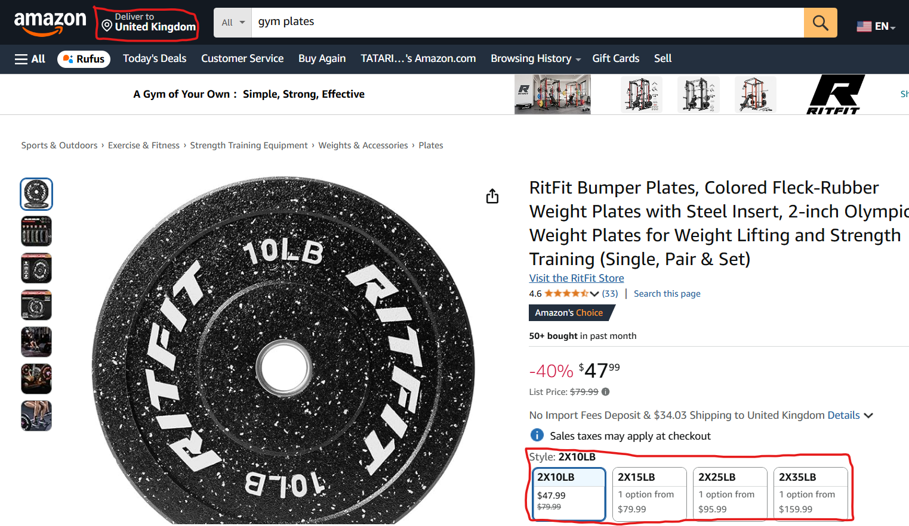
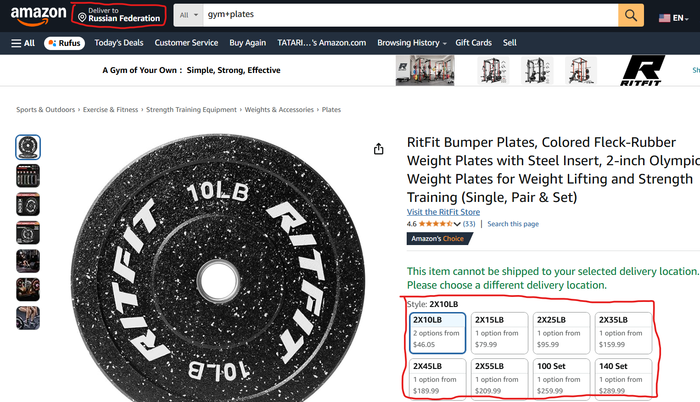

# Invalid weight units after changing the country region
## BUG-LOC-5
### Localization Bug Type
### Description
The weight for a plate is in lbs (pounds) when the country region is United Kingdom, but when it is changed to Russian Federation it doesn't change to kgs (kilograms)
### Steps to Reproduce
1. Enter Amazon main page
2. Search for any 'gym plates'
3. Check the weight measurement
4. Change the region from UK to Russian Federation (or other country where weight unit is not lbs but kgs)
5. Check the weight measurement again
### Expected Result
The plate weight has to be changed from 10lbs to 4.5kgs
### Actual Result
The plate weight remains as it was (10lbs)
### Priority
P3 - Low
### Severity
s4 - Cosmetic
### Environment
1. Browser Version: Google Chrome Version 135.0.7049.115
2. Web Application Version: Amazon 2025 (no version info found)
### Logs

