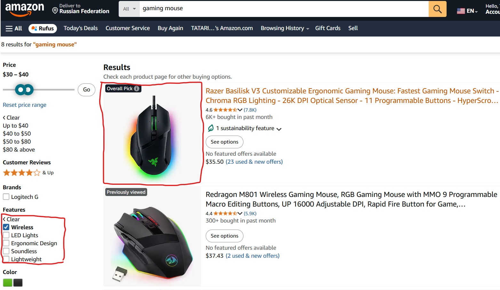

# Wired gaming mouse appears after filtering only wireless feature
## BUG-SMK-12.1
### Functional Bug Type
### Steps to Reproduce
1. Enter Amazon Web Page
2. Input 'gaming mouse' to search
3. Choose filter 'Features' -> 'Wirreless'
### Expected Result
The list of items will show only wireless connected mouses
### Actual Result
The list of items include both wireless and wired mouses
### Priority
P2 - Medium
### Severity
S2 - Major
### Environment
1. Browser Version: Google Chrome Version 135.0.7049.115
2. Web Application Version: Amazon 2025 (no version info found)
### Logs
