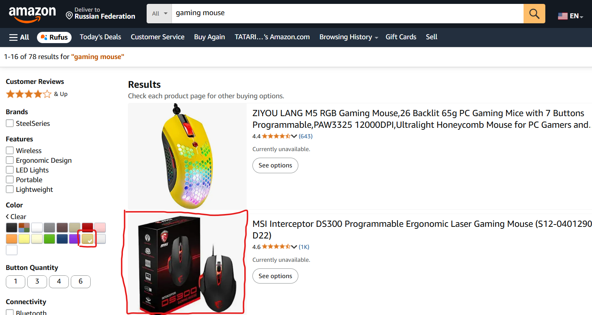
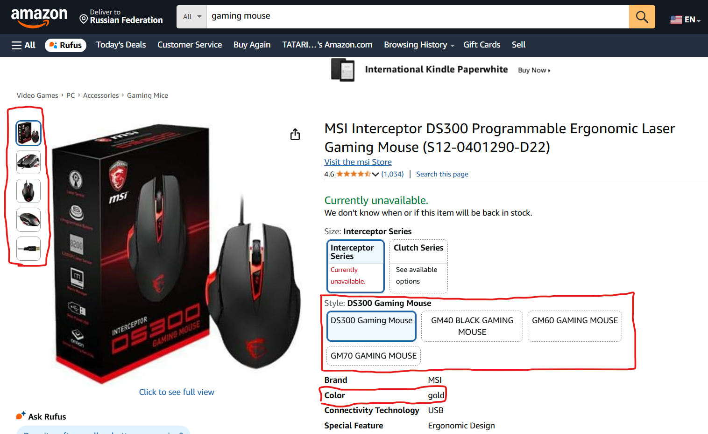

# Not Gold coloured mouse appears after filtering only Gold color
## BUG-SMK-12.2
### Functional Bug Type
### Steps to Reproduce
1. Enter Amazon Web Page
2. Input 'gaming mouse' to search
3. Choose filter 'Color' -> 'Gold'
### Expected Result
The list of items will show only the mouses that contain gold colour version
### Actual Result
The list of items include mouse that has no gold color, only black and grey
### Priority
P2 - Medium
### Severity
S2 - Major
### Environment
1. Browser Version: Google Chrome Version 135.0.7049.115
2. Web Application Version: Amazon 2025 (no version info found)
### Logs

