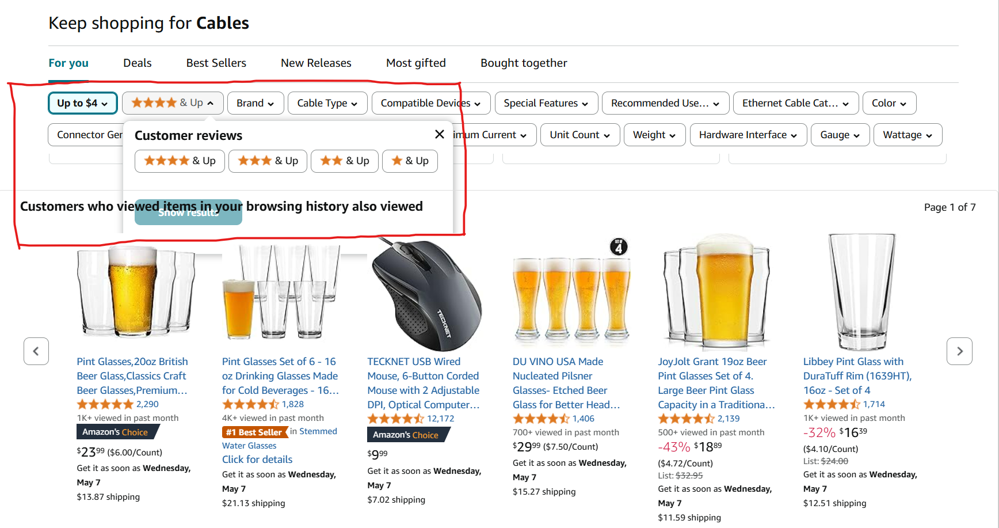

# Heading appears on top of filtering window
## BUG-EXP-1
### UI/UX Bug Type
### Steps to Reproduce
1. Enter Amazon main page
2. Choose 'Cables' category from main page
3. Set 'Price (\$)' filter as 'up to 4\$'
4. Go till the end of the page with products
5. Setup page so 'Customer Reviews' filter will be right above 'Customers who viewed items in your browsing history also viewed' heading
6. Click on 'Customer Reviews' (4 stars & Up)
### Expected Result
The panel with Customer Reviews will cover the heading, will be on its top
### Actual Result
The heading text is on top of Customer Reviews panel and 'Show Result' button is untouchable in her buttom half, but can be clicked on top
### Priority
P2 - Medium
### Severity 
S3 - Minor
### Environment
1. Browser Version: Google Chrome Version 135.0.7049.115
2. Web Application Version: Amazon 2025 (no version info found)
### Logs
